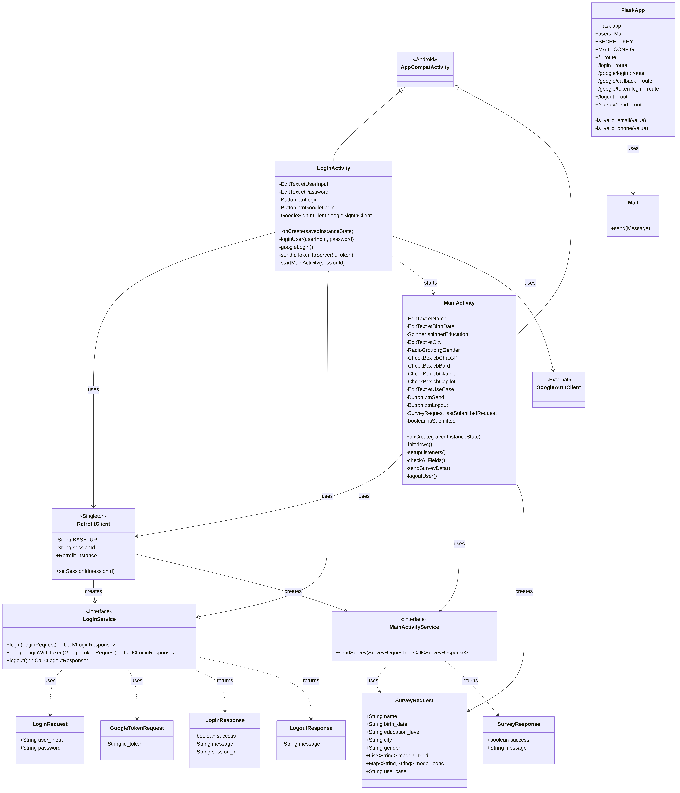

In order to run the tests do the following:
Clone the repository and install the requirements with "pip install -r requirements.txt".
Create an env file in the directory with the provided email and password.
Run the AISurveyApp with Android Studio.
On one terminal run appium with command: "appium".
On one terminal run the server application with command: "python app.py".
Modify platform/device names on setup function on test files according to the emulator/device you have.
On one terminal run the individual tests with command: "python test#.py".

## UML Diagrams

### Class Diagram

### Activity Diagram

### Sequence Diagram

### State Diagram

